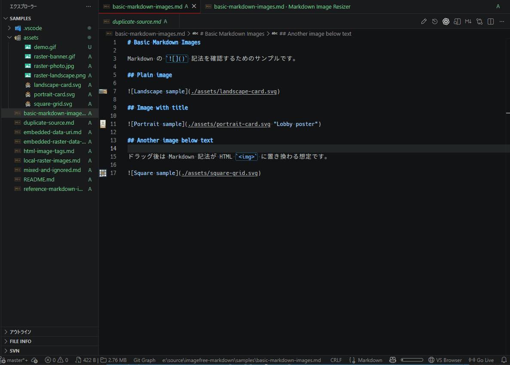

# Markdown Image Resize Viewer

Opens Markdown in a custom editor with draggable image resizing, reset actions, and preview-to-source jumps.

## Features

- Reopen a Markdown file with a dedicated custom editor
- Drag the lower-right handle of local images to resize them with the mouse
- Reset a resized image back to natural size by removing the committed `width`
- Jump from a preview image back to its Markdown source
- Support both inline Markdown images and reference-style Markdown images
- Convert Markdown image syntax into HTML `` tags with a `width` attribute when you commit a resize
- Update existing HTML `` tags and SVG `<image>` tags while preserving unrelated attributes
- Keep the built-in Markdown editor as the default editing experience

## Usage

### Open the custom editor

1. Open a Markdown file.
2. Run **"Markdown Image Resize Viewer: Open With Markdown Image Resize Viewer"** or use **Reopen Editor With...**.

### Resize an image

1. Open a Markdown file in the Markdown Image Resize Viewer custom editor.
2. Hover an image and drag the lower-right handle.
3. Release the mouse button to write the new width back into the Markdown source.

### Reset an image size

1. Hover a resized image.
2. Click **Reset**.
3. The `width` attribute is removed from the HTML image tag.

### Jump between preview and source

1. Hover a preview image and click **Source** to reveal its Markdown source.

## Requirements
- Visual Studio Code 1.85.0 or later
- A local Markdown file containing local or embedded image references

## Notes

- Opt-in custom editor view only. The default Markdown editor remains unchanged.
- The current release supports inline Markdown images, reference-style Markdown images, HTML `` tags, and SVG `<image>` tags.
- Remote `http` and `https` images are shown as read-only and are not resizable.
- Reset removes committed `width` values from HTML image tags and leaves other unrelated attributes intact.
- General text editing remains in the built-in Markdown editor.

## License

Licensed under MIT