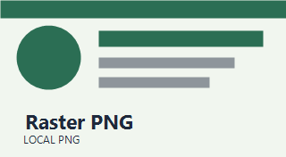
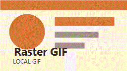
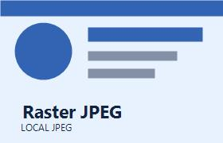

# Local Raster Images

ローカル参照でも SVG 以外の画像が問題なく表示・リサイズできるか確認するためのサンプルです。

## PNG in Markdown

## GIF with title

## JPEG in HTML

## Notes

- PNG と GIF は Markdown 記法、JPEG は既存 HTML `` タグの更新確認用です。
- ドラッグ後は Markdown 記法が HTML `` に変換され、既存 HTML は `width` のみ更新される想定です。